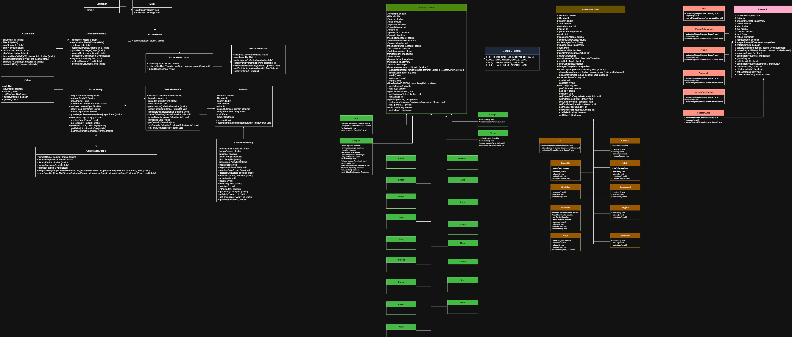

Bienvenidos, esta es la documentación de nuestro proyecto.

Primero queríamos hacer una pequeña introducción sobre de qué trata nuestro juego. 

La idea inicial que tuvimos para este es hacer un juego al estilo Plantas contra Zombies, hasta que se nos ocurrió que podríamos hacerlo sobre nosotros mismos contra cosas del mundo completamente aleatorias, nos gustó el concepto y ahí es donde nació Ninis VS Cosas, un juego en el que tienes que defender 5 filas de diferentes cosas (zombies) que vienen a atacar a los ninis (plantas) para llegar al bus y hacer que perdamos la partida, la decisión de que ninis usar para jugar la partida es completamente tuya entre un gran catálogo de estos que tienen diferentes precios, habilidades y ataques. Hay cientos de posibilidades.

El objetivo principal del juego es sobrevivir, ganas puntos según matas enemigos y van aumentando las rondas, desde la ronda de preparación hasta la ronda 10, la más complicada, con todos los enemigos yendo a por ti. La dificultad va incrementando.

También vamos a especificar por encima la estructura interna de nuestro proyecto de java entero y su funcionamiento.

Estos son los paquetes que tenemos en el proyecto:

Escenas (Son las pantallas visuales del proyecto)
Controladores (Son las clases controladoras del funcionamiento interno del juego)
Estadísticas (Son todas las clases que se encargan de las estadísticas)
Logros (Son los logros del juego)
Modelos 
Ninis (Todos los ninis)
Cosas (Todas las cosas)
Gestores (Todos los gestores que usa el juego internamente)
Proyectiles (Todos los proyectiles)
Items (Todos los items que hay dentro del juego)
Resources (Son todas las carpetas con imagenes, gifs y recursos en general)

Todos estos paquetes tienen sus clases internas que hacen que el juego funcione correctamente. Hemos intentado seguir cierto orden para ello. Todo puede ser visto a mayor detalle dentro del proyecto.

El juego es ejecutable desde la clase Launcher. NO intentar ejecutarlo desde main, no funcionará, explicación en comentarios del código.

Notas : 
El proyecto usa pixeles como sistema de coordenadas, no es redimensionable (1280x720)
Quedan muchas cosas por mejorar, esta es la primera versión “completa” del juego.

Debido a que hemos querido hacer el juego para que se vea de forma gráfica en vez de en la terminal hemos tenido que hacer una investigación para ampliar nuestro conocimiento respecto a formas de hacer esto mismo. En nuestro caso hemos estado trabajando con diferentes medios para hacer que funcione:

JavaFX
Es una librería que permite crear interfaces gráficas en Java. Trae consigo muchas herramientas que facilitan el trabajo de creación de todo esto.

Cosas que incluye:
Stage: Ventana principal de la aplicación
Scenes: Contenedor de la interfaz visible
Pane: Contenedor que permite añadir elementos gráficos
ImageView: Elemento que muestra imágenes
AnimationTimer: Lo que nos permite que el juego se ejecute con sus FPS

Todo esto entre algunas otras cosas como elementos gráficos que nos da JavaFX son lo que han permitido el desarrollo del juego. Y como ejemplo, el Stage es lo que nos permite tener la venta, mientras que el Scene nos da la pantalla del juego y el Pane nos deja añadir cosas como un ImageView. Mientras todo esto funciona por una parte, el AnimationTimer se ejecuta 60 veces por segundo actualizando toda la lógica interna del juego.

Además, hemos investigado y usado a lo largo del proyecto disparadores, los cuales son partes de código que no se ejecutan hasta que salte un evento. Un ejemplo de ello es cuando pulsamos cualquier botón que hay, cuyo código contenido se ejecutab al ser pulsado.

Para el apartado de estadísticas, hemos adjuntado a nuestros proyecto un XML con su propio DTD, XSD y XSLT. Para que todo sea automático hemos creado:

- Un inicializador del XML, el cual comprueba si el documento está creado (si no está lo crea).

- Un escritor que mediante una fábrica genera nuevas entradas o las remplaza.

- Un transformador de XSLT a HTML, el cual, una vez leído y escrito los nuevos cambios, genera una página web de HTML siguiendo la plantilla creada en el XSLT (ya que así simplemente abrimos en HTML y nos mostraría el contenido de forma sencilla).

Maven
Es una herramienta que hemos usado la cual sirve para gestionar el proyecto mediante la automatización de la descarga y gestión de las dependencias o librerías de los proyectos.

Para toda esta nueva información, de algún sitio teníamos que sacarla, por eso queríamos poner aquí alguna de las páginas, videos y referencias de donde nos hemos informado para haber conseguido hacer todo esto.

https://openjfx.io/
https://www.youtube.com/watch?v=3G7Ntt_DMI8
https://www.youtube.com/watch?v=zqOEWurb7cw
https://www.youtube.com/watch?v=9XJicRt_FaI
https://youtube.com/playlist?list=PL_QPQmz5C6WUF-pOQDsbsKbaBZqXj4qSq
https://www.youtube.com/watch?v=wOQFfnRuYO8
https://www.youtube.com/watch?v=XmedRW3ARSk
https://www.youtube.com/watch?v=KCVOc5_hb8g

Hay muchas paginas, videos y referencias que hemos obtenido a lo largo del desarrollo las cuales no hemos documentado así que no podemos poner aquí pero ha habido muchas más.

Importante:

Conste que por razones más que evidentes todas las personas que aparecen en el juego son completamente conscientes de su aparición en el juego y tenemos permiso y consentimiento directo de ellos mismos. 

Aquí dejamos nuestro diagrama UML:

